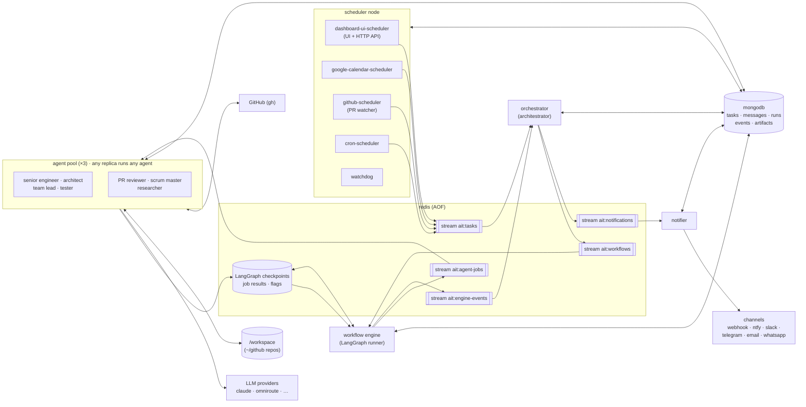
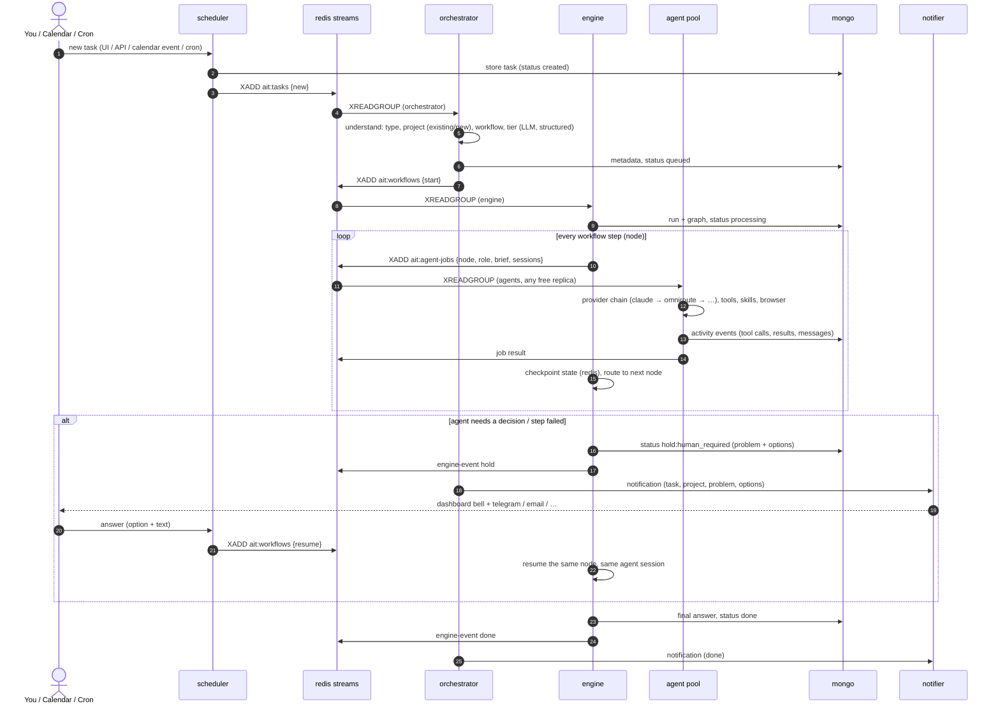
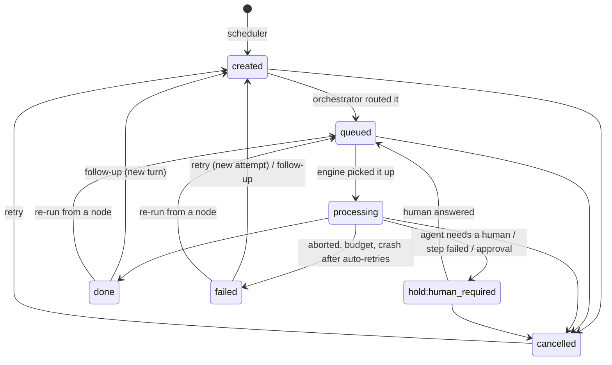

# AI Team: a multi-agent platform

You describe a task in plain words on the dashboard, or put it in Google Calendar or on a cron
schedule. The platform works out what kind of task it is and which project it targets, then picks a
workflow. A pool of agents executes the workflow step by step, with full-access tools, your Claude
skills and a headless browser. When the agents need a decision, the task waits for you and you get a
notification. Every run is drawn on the dashboard as a live graph.

Built on **LangGraph** (workflows, durable checkpoints, human-in-the-loop), **Redis** (broker and state),
**MongoDB** (task store) and a **Docker Swarm** stack.

## Architecture

### High level



| Node (swarm service) | Replicas | Role | Task status it sets |
|---|---|---|---|
| `scheduler` | 1 | Dashboard and HTTP API (dashboard-ui-scheduler), cron schedules, Google Calendar polling, GitHub PR watcher and a watchdog. Creates tasks and pushes them to the broker. Also handles follow-ups, retries, cancels, human answers and node re-runs. | `created` |
| `orchestrator` | 1 | Consumes tasks and works out the task type, project (existing or new), workflow and model tier. Hands the run to the engine. Watches run outcomes: notifications, plus auto-retry of crashed runs. | `queued` |
| `engine` | 1 | Runs LangGraph workflows. Each step becomes an agent job. Handles state, retries, errors, human holds, node re-execution and crash resume. | `processing`, `hold:human_required`, `done`, `failed` |
| `agent` | 3 | Executes jobs in full-access mode: files, shell, git, curl/fetch, web search, Playwright browser, SQLite and skills. Routes to LLM providers with fallback. | — |
| `notifier` | 1 | Stores every notification and forwards it to the enabled channels. | — |
| `redis` | 1 | Broker (Redis Streams with consumer groups), workflow checkpoints, job results, cancel flags, heartbeats. AOF with fsync every second, in `data/redis`. | — |
| `mongo` | 1 | Task store, in `data/mongo`. | — |

All app services run the same image with a different command (`python -m app <service>`).

### Data flow of a task



### Task status lifecycle



## Workflows

Defined in `src/app/workflows/` (LangGraph). The orchestrator picks one per turn; `configs/workflows.yaml`
holds the defaults per task type and the execution policies.

| Workflow | Used for | Steps (agent) |
|---|---|---|
| `coding` | development, bugfix, docs, ops | inspect_repo, plan_changes (architect) → implement + unit tests (senior engineer) → test: cross-verify the feature for real (tester) → review (team lead) ↺ implement until approved (max rounds) → finalize |
| `research` | research / R&D | plan → search → analyze → synthesize (researcher) → finalize |
| `pr_review` | review a GitHub PR | inspect_pr (PR reviewer) → verify_pr in a temp worktree (tester) → review_pr (PR reviewer) → post_review on GitHub (PR reviewer; `post_mode`) → finalize |
| `scrum` | GitHub issues, boards, milestones, sprint/standup reports | collect_status → plan_actions → apply_actions → report (scrum master) → finalize |
| `task_execution` | enquiry, planning, code review, testing, mixed | receive → understand, plan_task (architect) → select_agent → execute_agent (any agent) \| research \| coding \| validation (tester → team lead) → validate_result (team lead) → next step / replan → complete (architect) → finalize |

Every graph starts with validate_task → load_context (conversation, per-project memory, project layout).

Every graph also has:
- **approval**: the human-in-the-loop gate. An agent ends its answer with
  `NEEDS_HUMAN: {"problem": ..., "options": [...]}`. The run pauses with a LangGraph `interrupt`,
  checkpointed in Redis. Your answer resumes the **same node and the same agent session**.
- **handle_error**: a step that still fails after its automatic retries puts the task on hold with
  *retry* / *abort* options (`on_error: ask_human`), or fails it outright (`on_error: fail`).
- **approval_before**: a policy that makes chosen nodes, e.g. `implement`, wait for your go-ahead first.

**Re-execute a node:** click a step in the graph, then **Re-run from here**. The engine forks the run
from the checkpoint just before that step, so earlier steps are not repeated.

**Continue the chat:** a finished task takes follow-ups. Each one is a new *turn*: the orchestrator
routes it again (it may switch workflow, e.g. research → coding), and agents resume their own sessions,
so they remember the earlier turns.

## Durability and recovery

| Failure | What happens |
|---|---|
| Engine crashes mid-run | Its `start`/`resume` message is still pending. On restart (same consumer name `ai_team_engine.1`) it re-reads it, finds the run's checkpoint and continues from the last finished node. A job already dispatched is not sent again (job ids are idempotent). The engine waits for the job's result. |
| Agent crashes mid-job | The job stays pending. The restarted replica re-reads its own pending jobs, and a job left by a replica that never returns is claimed by a peer after `broker.claim_idle_seconds`. Live jobs keep their claim fresh, so peers never steal them. |
| Orchestrator / scheduler restart | Pending messages are redelivered. A task whose broker message was lost (stuck in `created`) is re-published by the watchdog. |
| Whole host reboots | Redis AOF and Mongo files live in `data/`; swarm restarts everything; runs resume as above. |
| Provider down / rate-limited | The job falls back to the next provider in the role's chain. |
| Step keeps failing | Node retries, then hold with retry/abort. A run that *crashed* is auto-retried by the orchestrator (`auto_retries`). |
| A component goes silent | The watchdog sends a `component_down` notification. |

Checked locally: `kill -9` of the whole platform in the middle of a `search` step. After restart the
run continued from `search`, `plan` was not repeated, and the run finished.

## LLM providers

Named providers in `configs/models.yaml`, switched on with `AI_TEAM_PROVIDERS` in `.env`:

| Provider | Type | Agent loop | Auth |
|---|---|---|---|
| `claude` | `claude_code` | Claude Code CLI (native tools, skills, Playwright MCP, `--resume`) | subscription token from `claude setup-token`; `./deploy.sh` does the login → swarm secret |
| `omniroute` | `openai` | LangChain agent with our tools | self-hosted OpenAI-compatible gateway (`AI_TEAM_OMNIROUTE_URL`) |
| `codex` | `codex` | Codex CLI | ChatGPT device login, run by `./deploy.sh` |
| `anthropic` | `anthropic` | LangChain | `ANTHROPIC_API_KEY` |
| `mock` | `mock` | fake, deterministic | none (runs the whole platform for free) |

- **Routing.** Each role has an ordered chain. The first enabled provider is used, the next ones are
  fallbacks. Defaults: `claude → omniroute → …` for agents, `omniroute → claude → …` for the
  orchestrator (cheap triage).
- **Tiers.** `fast` / `balanced` / `deep` map to each provider's models. A role's tier in
  `configs/agents.yaml` is a floor: the task's tier can raise it, never lower it.
- **Sessions** are kept per role *and* provider. They are shared by all agent replicas
  (`data/claude-home`, `data/codex`, Redis checkpointer), so the next step resumes the conversation on
  whichever replica gets it.
- **Adding a provider** that speaks an existing type, e.g. another OpenAI-compatible gateway, is one
  YAML entry. A new type is one class in `src/app/llm/providers/` registered in `llm/factory.py`
  (Google, Ollama and Bedrock types are already there).

## Agents, tools and skills

The pre-built agents: persona in `src/app/agents/<role>/prompt.py`; title, tier and tools in
`configs/agents.yaml`. The System tab shows the roster.

| Agent | Role | Owns |
|---|---|---|
| **Senior Software Engineer** (`senior_engineer`) | Implements features and fixes, writes and runs unit tests, keeps the build green | coding/implement, task steps |
| **Platform Architect** (`architect`) | Task planner: explores, designs, breaks work into steps with acceptance criteria | coding/inspect_repo + plan_changes, task_execution/understand + plan + replan + complete |
| **Team Lead** (`team_lead`) | Task reviewer: judges the work against request and criteria, approves or sends it back | coding/review, task_execution/validate_result, validation/judge |
| **Tester** (`tester`) | Cross-verifies the feature works as expected: runs the app, API calls, browser, suites (doesn't fix) | coding/test, validation/run_checks, pr_review/verify_pr |
| **PR Reviewer** (`pr_reviewer`) | Reviews GitHub PRs (diff, context, CI) and posts the review | pr_review/* |
| **Scrum Master** (`scrum_master`) | Maintains GitHub projects: issues, labels, milestones, boards, sprint/standup reports | scrum/* |
| Researcher (`researcher`) | Web/docs/browser research with sources | research/*, task steps |
| Orchestrator (`orchestrator`) | Routes tasks (structured output only) | orchestrator service |

**Adding an agent:**
1. Create `src/app/agents/<role>/` with `prompt.py` and `agent.py`.
2. Register it in `agents/registry.py` and add it to `configs/agents.yaml`.
3. Use it from a workflow node with `run_agent(state, node, "<role>", instruction)`. The task_execution
   planner can also assign steps to it once it is listed in `prompts/templates/plan_steps.md`.

All roles run in **full-access mode** inside the agent containers:

| Tool group | Tools (chat-model providers) | CLI providers |
|---|---|---|
| filesystem | `list_dir`, `read_file`, `write_file`, `edit_file`, `search` | native |
| shell | `run_command` (bash: tests, builds, curl, package managers…) | native |
| git | `git_status`, `git_diff`, `git_commit` (push only with `AI_TEAM_GIT_PUSH_ENABLED`) | native |
| github | `gh` (any GitHub CLI command: PRs, reviews, issues, projects) | `gh` via shell |
| web | `web_search` (DuckDuckGo or SearXNG), `http_fetch` | native |
| browser | `browser` (headless Chromium via Playwright: navigate, click, fill, eval, screenshot) | Playwright MCP |
| database | `sql_query`, `sql_schema` (SQLite files) | via shell |
| skills | `list_skills`, `load_skill` | native (`CLAUDE_CONFIG_DIR/skills`) |

**Skills.** `./deploy.sh` copies all your Claude skills (`~/.claude/skills`, including synced ones, and
every plugin's skills) into `data/skills`. That is 51 skills today; they are re-synced on each deploy.

**Hard lines, even in full-access mode:**
- the `ai-team/` folder (tmpfs over `/workspace/ai-team`) and `/run/secrets` are off-limits
- host-wrecking commands (`rm -rf /`, `mkfs`, `sudo`, …) are refused
- secrets are redacted from everything stored or shown

Agents see only the workspace (`~/github` → `/workspace`) and run as your UID.

## GitHub

1. **Enable it:** set `AI_TEAM_GITHUB_ENABLED=true` in `.env.prod` and run `./deploy.sh` from a terminal.
   It logs the `gh` CLI in with the device flow (scopes `repo, read:org, project, workflow`) and stores
   the login in `data/github`. Non-interactive: `GH_TOKEN=... ./deploy.sh`.
2. **Who uses it:** agents use `gh` for PR reviews, issues and projects, and the scheduler uses it to
   watch repos.
3. **PR watcher (github-scheduler):** list repos in `AI_TEAM_GITHUB_WATCH_REPOS` (`owner/repo,…`).
   - Each new non-draft PR becomes a `pr_review` task: only PRs requesting your review, or every open
     PR with `AI_TEAM_GITHUB_WATCH_FILTER=all`.
   - A new push to a PR gets reviewed again.
   - If a workspace folder has the repo's name, it is used as the project.
4. **Posting reviews:** `policies.pr_review.post_mode` in `configs/workflows.yaml`:
   - `comment` (default): a neutral review comment that states the verdict
   - `verdict`: actually approve or request changes
   - `none`: report only, don't post
5. **Pushing is off by default.** With `AI_TEAM_GIT_PUSH_ENABLED=true`, agents may push feature branches
   and open PRs when a task asks, but never to the default branch.
6. **Scrum master safety:** it never deletes issues, repos, branches or projects; it closes with a
   reason instead. Add `apply_actions` to `approval_before` if you want to approve its changes first.

## Notifications

The notifier stores every notification (the dashboard bell) and forwards it to each enabled channel in
`configs/notifications.yaml` whose filters accept it:

| Event | When |
|---|---|
| `hold` | Human required. Includes task, project, step, problem and options, plus a dashboard link. |
| `failed` | Task failed. |
| `done` | Task finished. |
| `component_down` | A whole component kind stopped heartbeating. |
| `test` | System tab → *Send test notification*. |

Channels shipped: **webhook** (JSON), **ntfy**, **Slack**, **Telegram**, **email (SMTP)**, **WhatsApp**
(Meta Cloud API).
- **Turning one on:** a channel switches on when its settings in `.env` are filled in
  (`enabled: auto`). Each channel has its own `events` / `levels` / `projects` filters and `retries`.
- **Delivery results:** recorded per channel, shown in the bell and on the task's activity.
- **Adding a channel** (Discord, Teams, SMS…): one `Channel` subclass in
  `src/app/services/notifier/channels/`, registered in `channels/registry.py`, plus a YAML entry.

## Logging and observability

Every step is logged twice: to the task's **Activity** tab (Mongo `events`, filterable) and as a line in
the service logs (`docker service logs -f ai_team_engine`, …):

```text
task=12 run=12-t1-a1 orchestrator [status] understood by omniroute: bugfix · project shop · workflow coding · balanced — …
task=12 run=12-t1-a1 engine/implement [status] ▶ step `implement` started
task=12 run=12-t1-a1 coder@ai_team_agent.2 [status] coder on omniroute (auto/best-coding, balanced)
task=12 run=12-t1-a1 coder@ai_team_agent.2 [tool] run_command(command='pytest -q', cwd='.')
task=12 run=12-t1-a1 coder@ai_team_agent.2 [tool_result] run_command → 812 chars in 4.1s: exit=0
task=12 run=12-t1-a1 engine/implement [status] job 12-t1-a1:e0:implement:2:0 ok after 95.2s — coder on ai_team_agent.2 via omniroute/auto/best-coding, 3 file(s) changed
task=12 run=12-t1-a1 engine/implement [status] ✓ step `implement` done in 95.3s
task=12 run=- notifier [status] notification [done] 'Done · task #12: …': dashboard, sent via telegram
```

- **Runs:** node status, attempts and timing per run (`runs`); each node's full output is in
  `artifacts` (click a node in the graph).
- **Components:** heartbeats every 10s (System tab, `/api/meta`).
- **Metrics:** counters at `/api/metrics` (Prometheus text). Set `LANGSMITH_*` env vars for LangSmith
  traces.

## Environments

| | Production | Local development |
|---|---|---|
| Runs on | Proxmox `docker-vm.local.internal` (192.168.100.10), single-node Docker Swarm, port block 10800–10899 | your machine, `docker compose` |
| File | `stack.yml` (+ generated `stack.generated.yml` for secrets) | `docker-compose.yml` |
| Config | `.env.prod` | `.env` |
| Start | `./deploy.sh` | `docker compose up --build` / `docker compose watch` |
| Dashboard | http://ai-team.local.internal (direct: http://192.168.100.10:10800) | http://localhost:8765 |
| Data | `/data/stacks/ai-team/data` on docker-vm | `./data/dev` (+ shared logins in `./data`) |
| Agents' repos | `/data/stacks/ai-team/workspace` on docker-vm | `AI_TEAM_WORKSPACE_ROOT` (e.g. `~/github`) |
| Providers | from `.env.prod` | `mock` by default (free); switch in `.env` |

Both env files are gitignored; `.env.example` documents every setting.

### Production: `./deploy.sh` → docker stack on Proxmox

```bash
docker context create docker-vm --docker host=ssh://docker-vm   # one-time (already done here)
./deploy.sh                    # uses .env.prod
./deploy.sh --relogin          # rotate the Claude token / redo the Codex + GitHub device logins
./deploy.sh --smoke            # plus one small real task end to end
./deploy.sh --env other.env    # another target, e.g. a local swarm (AI_TEAM_DEPLOY_CONTEXT=default)
```

What it does, all through the Docker context over SSH:
1. **Builds the image** on the docker-vm engine, so no registry is needed. With `AI_TEAM_REGISTRY`, it
   builds locally, pushes, and the target pulls (`--resolve-image always`) instead.
2. **Prepares the target:** creates the data and workspace dirs there and ships your Claude skills
   (`scripts/sync_skills.sh`) to the target's `data/skills`.
3. **Checks every enabled provider and GitHub on the target** with one tiny real call. Logins run there
   too: Claude token → swarm secret, Codex/GitHub device login → target `data/codex`, `data/github`.
   The Claude token is kept locally in `data/deploy/<context>/`.
4. **Runs `docker stack deploy --prune` and verifies the deploy:**
   - each service is healthy on the new image, with no swarm rollback
   - Redis AOF is on and Mongo is writing to the data dir
   - all components are heartbeating and the expected providers are enabled
   - the dashboard answers on `AI_TEAM_DEPLOY_HOST:AI_TEAM_PORT`
   - agents are isolated and have their toolbox and skills

   On failure it prints each service's tasks and logs, then exits 1. A version that doesn't start is
   rolled back by swarm. `DEPLOY_TIMEOUT` defaults to 300s.

Notes:
- **The workspace on the server starts empty.** Clone the repos the team should work on into
  `/data/stacks/ai-team/workspace`, or ask the team to: with GitHub enabled the agents can
  `gh repo clone`.
- **Friendly name.** `ai-team.local.internal` resolves like every other `*.local.internal` name:
  Pi-hole (`local-server/reception/pihole/local-dns.list`) → Nginx Proxy Manager on docker-vm (proxy host
  `ai-team.local.internal` → `192.168.100.10:10800`) → the scheduler. The stack is also listed on the
  `local.internal` homepage, in `local-server/proxmox/ports.md`, and has an Uptime Kuma monitor (AutoKuma).
- **No auth on the dashboard.** It is reachable from the LAN without auth, on the name and on :10800.
- **Internal traffic skips the proxy.** Containers call OmniRoute at `192.168.100.10:10200`, not
  `omniroute.local.internal`, because NPM's 90s proxy timeout would cut long LLM calls.
- **Operations:**
  - Logs: `docker --context docker-vm service logs -f ai_team_<service>`
  - Scale agents: `AI_TEAM_AGENTS`
  - Remove: `docker --context docker-vm stack rm ai_team` (data stays)
- **History from v1:** `scripts/seed.py --from-sqlite` imports the old SQLite tasks.
- **Logins are first-time interactive.** Claude, Codex and GitHub logins need an interactive terminal the
  first time. Non-interactive alternatives: `CLAUDE_CODE_OAUTH_TOKEN=… ./deploy.sh` and
  `GH_TOKEN=… ./deploy.sh`.

**Google Calendar:**
1. Google Calendar → *Settings* → your calendar → copy the *Secret address in iCal format* into
   `AI_TEAM_GCAL_ICS_URLS`.
2. Events whose title contains `[ai]` become tasks when they start.

**Cron:** Schedules tab (UTC cron expressions).

### Local development: docker compose

```bash
cp .env.example .env                 # once; AI_TEAM_PROVIDERS=mock costs nothing
scripts/sync_skills.sh data/skills   # optional: your Claude skills for the agents
docker compose up --build            # whole platform: redis, mongo, 5 components, 2 agents
docker compose watch                 # same, plus live sync of src/ and configs/ (restarts the services)
```

- Dashboard on http://localhost:8765. Redis is on `127.0.0.1:16379` and Mongo on `127.0.0.1:17017`
  for inspection.
- Dev data lives in `./data/dev`. Provider and GitHub logins are shared with `./data` (`claude`,
  `codex`, `github`).
- Singletons have fixed hostnames, so their pending work resumes after a restart. Agent replicas
  don't: a restarted agent's unfinished job is taken over after `broker.claim_idle_seconds`.

## Develop and test

```bash
python3 -m venv .venv && .venv/bin/pip install -e '.[dev]'
.venv/bin/pytest                                   # unit + in-process workflow tests (mock provider)
AI_TEAM_E2E_URL=http://localhost:8765 .venv/bin/pytest tests/integration   # e2e against a mock environment
python scripts/evaluate.py                         # orchestrator routing accuracy on real providers
python scripts/run_local.py                        # alternative: everything in one process, no compose
```

The mock provider takes markers in the task text to drive scenarios: `[ask]` (human hold), `[fail]`
(step failure), `[slow]`, `[code]` (task_execution plans a coding sub-workflow).

## Layout

```text
configs/            app.yaml · models.yaml (providers, routing) · agents.yaml (roster) · workflows.yaml · notifications.yaml
src/app/
  main.py           python -m app scheduler|orchestrator|engine|agent|notifier|all|health
  domain/           task, run, stream envelopes, statuses
  services/         one package per node: scheduler/ (api, cron, google_calendar, github, monitor) · orchestrator/
                    engine/ · agent/ · notifier/ (channels/)
  workflows/        common/ (state, tracking, approval, recovery, nodes) · task_execution/ · research/ · coding/
                    pr_review/ · scrum/
  agents/           base (provider chain, NEEDS_HUMAN) · architect/ · senior_engineer/ · team_lead/ · tester/
                    pr_reviewer/ · scrum_master/ · researcher/ · orchestrator/
  llm/              providers/ (claude_code, codex, openai, anthropic, google, ollama, bedrock, mock) · router · fallback
  tools/            filesystem · shell · git · github · web · browser · database · skills
  orchestration/    broker (Redis Streams) · policies · selectors · cron maths
  runtime/          graph_runner (engine core) · executor (jobs) · cancellation · retry
  persistence/      mongo/redis clients · task & run repositories · artifacts · checkpoints
  memory/           short-term (conversation) · long-term (per-project notes) · context builder
  guardrails/       input · output redaction · tool permissions · budget
  observability/    events (activity log) · logging · metrics · tracing
  api/              FastAPI routes + static dashboard
tests/              unit/ · workflows/ · integration/ (e2e) · evals/
stack.yml           production swarm stack (deploy.sh adds stack.generated.yml for secrets)
docker-compose.yml  local development
scripts/            run_local.py · seed.py · evaluate.py · sync_skills.sh
```

**Caveat:** in full-access mode agents can run any command in the workspace and make local git commits.
They run as the same user that can read their provider credentials (the Claude token secret,
`/data/codex`). Output is redacted, but treat credentials as exposed to anything the agents run.
